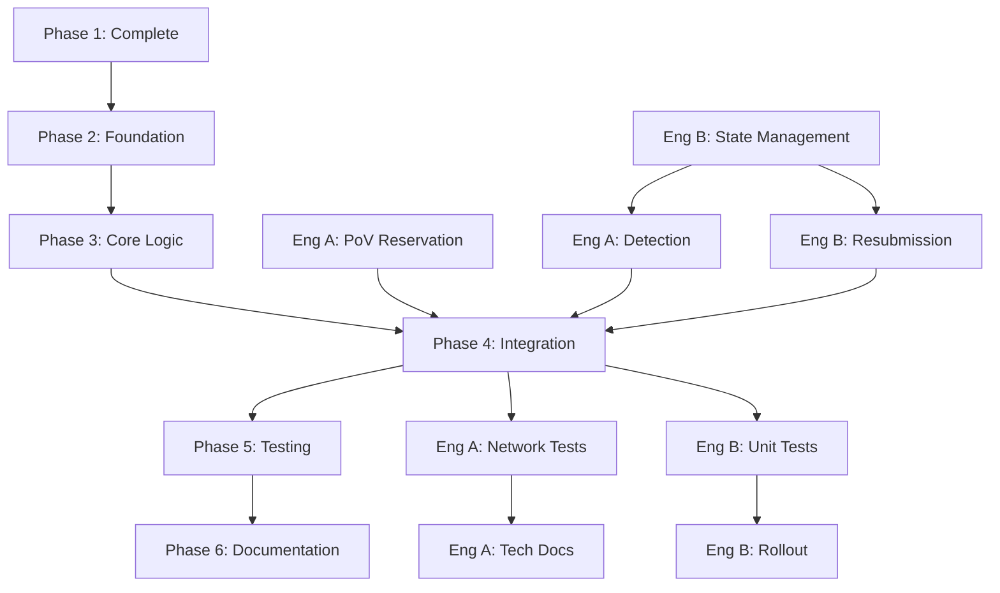

# Collation Resubmission Support Design

## Overview

This document describes the design for collation resubmission support in candidate descriptor v3, enabling collators to resubmit previously-built blocks when the original submission fails to get backed or included in the relay chain.

**Status**: Draft
**Team Size**: 2 Engineers
**Timeline**: 8-10 weeks (parallelized work)
**Related PRs**:
- [#10449](https://github.com/paritytech/polkadot-sdk/pull/10449) - Low Latency v2 Design
- [#10472](https://github.com/paritytech/polkadot-sdk/pull/10472) - Polkadot-side implementation
- [#10742](https://github.com/paritytech/polkadot-sdk/pull/10742) - Cumulus-side implementation

## Context & Motivation

### Problem Statement

In the current parachain block production model, several scenarios can cause valid blocks to be dropped before inclusion:

1. **Timing issues**: Collation arrives too late to be backed in the current relay chain block
2. **Relay chain forks**: Collation submitted to a fork that doesn't become canonical
3. **Session boundaries**: Blocks built near session transitions may be dropped
4. **Configuration changes**: Runtime upgrades can invalidate pending candidates

When a block is dropped, the collator must rebuild from scratch, wasting:
- Computation resources (block execution)
- Time (increased confirmation latency)
- Transactions (duplicate execution of the same operations)

### Goals

1. **Reduce wasted computation**: Reuse already-built blocks instead of rebuilding
2. **Improve time-to-finality**: Submit existing blocks with updated scheduling context
3. **Maintain security**: Ensure only authorized collators can resubmit
4. **Preserve decentralization**: Reputation flows to the resubmitting collator

### Low Latency v2 Context

Resubmission is enabled by the Low Latency v2 design's separation of:
- **Relay Parent**: Execution context (where the block was built)
- **Scheduling Parent**: Fresh relay chain tip for core assignment

This allows updating the scheduling context (`scheduling_parent`) without re-executing the block (keeping `relay_parent` unchanged).

## Architecture Overview

### High-Level Flow

```
┌─────────────┐
│  Collator A │  (Builds block at relay_parent R1, scheduling_parent S1)
└──────┬──────┘
       │
       │ Submit collation
       ▼
┌─────────────────┐
│  Relay Chain    │  Block not backed in time
└─────────────────┘
       │
       │ Time passes, new relay tip S2
       ▼
┌─────────────┐
│  Collator B │  (Eligible for current slot)
└──────┬──────┘
       │
       │ 1. Detect resubmission opportunity
       │ 2. Read block from storage (relay_parent still R1)
       │ 3. Sign new scheduling info (core_selector, S2)
       │ 4. Build new header chain (S2 → ... → R1)
       │ 5. Submit with updated SchedulingProof
       ▼
┌─────────────────┐
│  Relay Chain    │  Block backed and included
│                 │  Reputation → Collator B
└─────────────────┘
```

### Components

1. **Primitives Layer** (✅ Implemented)
   - `SignedSchedulingInfo`: Signature + core selection + peer_id
   - `SchedulingInfoPayload`: What gets signed (core_selector + eligibility_parent)
   - `SchedulingProof`: Header chain + optional signed scheduling info
   - Validation logic in PVF

2. **Collator Layer** (❌ To be designed)
   - **Resubmission Detector**: Monitors for failed collations
   - **Block Storage**: Tracks resubmittable blocks
   - **Resubmission Engine**: Builds updated collations
   - **State Coordinator**: Prevents duplicate submissions

3. **Runtime Layer** (⚠️ Partial)
   - PoV space reservation enforcement
   - Configuration for resubmission parameters

## Design Decisions

### 1. When to Resubmit

#### Trigger Conditions

A collation becomes eligible for resubmission when **all** of these conditions are met:

1. **Original submission failed**: Block was not backed within a configurable timeout
2. **Block is still valid**: `relay_parent` has not expired (within async backing window)
3. **No newer block exists**: No descendant block has been built on the same parent
4. **Current collator is eligible**: Must be the slot author for the current `eligibility_parent`
5. **Resubmission limit not exceeded**: Per-block maximum attempts not reached

#### Decision Timeline

```
T0: Block built and submitted (relay_parent = R1, scheduling_parent = S1)
    │
T0 + BACKING_TIMEOUT: Check if backed
    │
    ├─ Backed: Success, cleanup
    │
    └─ Not backed: Mark as resubmittable
        │
T0 + RESUBMISSION_WINDOW: Monitor for resubmission slot
    │
    ├─ Eligible slot: Attempt resubmission
    │
    └─ No eligible slot: Wait or expire
        │
T0 + MAX_RESUBMISSION_WINDOW: Expire and cleanup
```

**Configuration Parameters** (Runtime):

```rust
/// Time to wait before considering a collation failed.
/// Should be > relay_chain_slot_duration to allow for backing.
pub const BACKING_TIMEOUT: Duration = Duration::from_secs(12); // ~2 relay blocks

/// Maximum time window for resubmission attempts.
/// After this, the block is considered too old and is dropped.
pub const MAX_RESUBMISSION_WINDOW: Duration = Duration::from_secs(60); // ~10 relay blocks

/// Maximum number of resubmission attempts per block.
/// Prevents spam from repeatedly resubmitting unbacked blocks.
pub const MAX_RESUBMISSION_ATTEMPTS: u32 = 3;
```

#### Detection Mechanism

**Option A: Active Monitoring (Recommended)**

Collators subscribe to relay chain events and actively track collation status:

```rust
enum CollationStatus {
    Pending,           // Submitted, waiting for backing
    Backed,            // Backed but not yet included
    Included,          // Included in relay chain (success)
    Failed,            // Not backed within timeout
    ForkSuspected,     // Relay parent not on canonical chain (fast-path)
    Orphaned,          // Relay parent definitively orphaned (cleanup)
    Resubmitted(u32),  // Resubmitted N times
}
```

**Monitoring Sources**:
1. **Backing/Inclusion Events**: Track when collations are backed or included
2. **Timeout Monitoring**: Detect when `BACKING_TIMEOUT` expires without backing
3. **Best Block Changes**: Detect potential forks (fast-path resubmission trigger)
4. **Finalized Block**: Detect definitive orphaned relay parents (cleanup trigger)

**Advantages**:
- Fast response to failures
- Can detect fork-related drops immediately
- Better for latency-sensitive operations
- Enables fast-path resubmission on forks

**Disadvantages**:
- Requires continuous relay chain monitoring
- More complex state management
- Must handle rapid best block changes

**Option B: Opportunistic Resubmission**

When building a new block, check if any previous blocks can be resubmitted:

**Advantages**:
- Simpler implementation
- No additional monitoring overhead
- Natural rate limiting

**Disadvantages**:
- Delayed reaction to failures
- May miss resubmission windows
- Less optimal for low block production rates

**Recommendation**: Implement **Option A** with active monitoring, as it better serves the low-latency goals of the v3 design.

### 2. Relay Chain Fork Handling

#### Problem

Relay chain forks present a critical challenge for resubmission:

1. **Collations on orphaned forks**: A collation submitted to relay parent R1 on fork A becomes invalid if fork B becomes canonical
2. **Wasted waiting time**: Without fork detection, the system waits `BACKING_TIMEOUT` (12s) before marking the collation as failed
3. **Invalid relay parent references**: A relay parent on an orphaned fork may no longer be accessible or valid for new submissions
4. **Async backing window considerations**: Forked relay parents may appear to be within the async backing window but are actually orphaned

#### Fork Detection Strategy

**Option A: Finalized Block Monitoring (Recommended)**

Monitor finalized blocks and check if tracked relay parents are ancestors of the finalized chain:

```rust
async fn on_finalized_block(finalized: RelayHash, cache: &mut ResubmissionCache) {
    // For each tracked collation
    for block in cache.pending_and_failed() {
        // Check if relay_parent is an ancestor of finalized
        if !is_ancestor(block.relay_parent, finalized).await {
            // Relay parent is on orphaned fork
            cache.mark_orphaned(block.block_hash);
        }
    }
}
```

**Advantages**:
- Definitive: Finalized blocks cannot be reverted
- Clean state management: Can safely remove orphaned blocks
- Simple implementation: Single ancestry check per block

**Disadvantages**:
- Delayed detection: Must wait for finalization (~2-3 relay blocks)
- May miss resubmission windows for blocks on recent forks

**Option B: Best Block Monitoring (Faster but Less Certain)**

Monitor best block changes and detect when tracked relay parents are not ancestors:

```rust
async fn on_best_block_changed(new_best: RelayHash, old_best: RelayHash, cache: &mut ResubmissionCache) {
    // Potential reorg detected
    if !is_ancestor(old_best, new_best).await {
        // Check all pending collations
        for block in cache.pending_and_failed() {
            if !is_ancestor(block.relay_parent, new_best).await {
                // Likely on orphaned fork, mark for fast resubmission
                cache.mark_fork_suspected(block.block_hash);
            }
        }
    }
}
```

**Advantages**:
- Fast detection: Immediate response to fork
- Enables quick resubmission on canonical chain
- Better for latency-sensitive operations

**Disadvantages**:
- False positives: Best block can change frequently
- May trigger unnecessary resubmissions
- Requires careful handling of transient forks

**Recommendation**: Implement **hybrid approach**:
- Use **Option B** for fast detection and immediate resubmission eligibility
- Use **Option A** for definitive cleanup of orphaned blocks
- Add `fork_suspected` state to distinguish from confirmed orphaned blocks

#### State Transitions for Forks

Extend the `CollationStatus` enum:

```rust
enum CollationStatus {
    Pending,              // Submitted, waiting for backing
    Backed,               // Backed but not yet included
    Included,             // Included in relay chain (success)
    Failed,               // Not backed within timeout
    ForkSuspected,        // Relay parent not on best chain (fast-path resubmission)
    Orphaned,             // Relay parent not ancestor of finalized (definitive)
    Resubmitted(u32),     // Resubmitted N times
}
```

**State Machine with Forks**:

```
                    ┌─────────┐
                    │ Pending │
                    └────┬────┘
                         │
              ┌──────────┼──────────┬─────────────┐
              │          │          │             │
       Backed │   Failed │    Expired      Fork detected
              │          │          │             │
              ▼          ▼          ▼             ▼
         ┌────────┐  ┌──────────────┐  ┌─────────┐  ┌───────────────┐
         │ Backed │  │ Resubmittable│  │ Expired │  │ForkSuspected  │
         └───┬────┘  └──────┬───────┘  └─────────┘  └───────┬───────┘
             │              │                               │
      Included│   Resubmitted│                   Resubmit immediately
             │              │                               │
             ▼              ▼                               ▼
        ┌─────────┐    ┌──────────────┐            ┌──────────────┐
        │Included │    │ Resubmitted  │            │ Resubmitted  │
        │(success)│    │  (pending)   │            │ (fast-path)  │
        └─────────┘    └──────┬───────┘            └──────────────┘
                              │
                       (cycle back to Pending)
                              │
                       Finalized & orphaned
                              │
                              ▼
                        ┌──────────┐
                        │ Orphaned │ (cleanup)
                        └──────────┘
```

#### Resubmission Eligibility with Fork Handling

Update eligibility check to verify canonical chain ancestry:

```rust
async fn check_resubmission_eligibility(
    block: &ResubmittableBlock,
    relay_client: &impl RelayChainInterface,
    keystore: &KeystorePtr,
) -> Result<ResubmissionContext, EligibilityError> {
    // 1. Get current relay chain tip (canonical chain)
    let scheduling_parent = relay_client.best_block_hash().await?;

    // 2. CRITICAL: Verify relay_parent is on canonical chain
    if !relay_client.is_ancestor(block.relay_parent, scheduling_parent).await? {
        return Err(EligibilityError::RelayParentNotOnCanonicalChain {
            relay_parent: block.relay_parent,
            best_block: scheduling_parent,
        });
    }

    // 3. Check relay_parent is still valid (within async backing window)
    if !is_within_async_backing_window(block.relay_parent, scheduling_parent).await {
        return Err(EligibilityError::RelayParentExpired);
    }

    // 4. Derive eligibility_parent from header chain
    let header_chain = build_header_chain(scheduling_parent, block.relay_parent).await?;
    let eligibility_parent = header_chain.last()?.parent_hash;

    // 5. Get Aura authorities at eligibility_parent
    let authorities = get_aura_authorities(eligibility_parent).await?;

    // 6. Derive slot from eligibility_parent
    let slot = get_slot_from_header(eligibility_parent).await?;

    // 7. Check if we have the key for the eligible authority
    let authority_index = (slot % authorities.len()) as usize;
    let eligible_authority = &authorities[authority_index];

    if !keystore.has_keys(&[(eligible_authority.to_raw_vec(), AURA_KEY_TYPE)]) {
        return Err(EligibilityError::NotEligibleCollator);
    }

    Ok(ResubmissionContext {
        scheduling_parent,
        eligibility_parent,
        header_chain,
        eligible_authority: eligible_authority.clone(),
        slot,
    })
}
```

#### Fork Detection Implementation

**Detection Service**:

```rust
pub struct ForkDetectionService {
    relay_client: Arc<impl RelayChainInterface>,
    cache: Arc<Mutex<ResubmissionCache>>,
}

impl ForkDetectionService {
    /// Monitor best block changes for potential forks
    pub async fn on_best_block_changed(&self, new_best: RelayHash) -> Result<()> {
        let mut cache = self.cache.lock().await;

        // Check all pending/failed collations
        for block in cache.pending_and_failed() {
            // Skip if already marked
            if matches!(block.status, CollationStatus::ForkSuspected | CollationStatus::Orphaned) {
                continue;
            }

            // Check if relay_parent is ancestor of new_best
            if !self.relay_client.is_ancestor(block.relay_parent, new_best).await? {
                // Mark for fast-path resubmission
                cache.mark_status(block.block_hash, CollationStatus::ForkSuspected)?;

                tracing::info!(
                    relay_parent = ?block.relay_parent,
                    new_best = ?new_best,
                    block_hash = ?block.block_hash,
                    "Collation relay parent not on canonical chain, marking for resubmission"
                );
            }
        }

        Ok(())
    }

    /// Monitor finalized blocks for definitive cleanup
    pub async fn on_finalized_block(&self, finalized: RelayHash) -> Result<()> {
        let mut cache = self.cache.lock().await;

        // Check all tracked collations
        for block in cache.all_tracked() {
            // Skip if already included or orphaned
            if matches!(block.status, CollationStatus::Included | CollationStatus::Orphaned) {
                continue;
            }

            // Definitive check against finalized chain
            if !self.relay_client.is_ancestor(block.relay_parent, finalized).await? {
                // Definitely orphaned, remove from cache
                cache.mark_status(block.block_hash, CollationStatus::Orphaned)?;

                tracing::warn!(
                    relay_parent = ?block.relay_parent,
                    finalized = ?finalized,
                    block_hash = ?block.block_hash,
                    "Collation relay parent orphaned, removing from cache"
                );

                // Cleanup after marking
                cache.remove(&block.block_hash)?;
            }
        }

        Ok(())
    }
}
```

#### Updated Trigger Conditions

A collation becomes eligible for resubmission when **all** of these conditions are met:

1. **Original submission failed OR fork detected**:
   - Block was not backed within `BACKING_TIMEOUT`, OR
   - Relay parent detected on orphaned fork (`ForkSuspected` state)
2. **Block is still valid**: `relay_parent` has not expired (within async backing window)
3. **Relay parent is on canonical chain**: `relay_parent` is ancestor of current best block
4. **No newer block exists**: No descendant block has been built on the same parent
5. **Current collator is eligible**: Must be the slot author for the current `eligibility_parent`
6. **Resubmission limit not exceeded**: Per-block maximum attempts not reached

**Fast-Path Resubmission for Forks**:

Collations marked as `ForkSuspected` bypass the `BACKING_TIMEOUT` and become immediately eligible for resubmission, allowing quick recovery from fork-related drops.

#### Configuration Parameters

Add fork-specific configuration:

```rust
/// Enable fast-path resubmission on suspected forks.
/// When false, fork-suspected collations still wait for BACKING_TIMEOUT.
pub const ENABLE_FORK_FAST_PATH: bool = true;

/// Time window within which reorgs are considered possible.
/// Collations older than this from finalized tip can be definitively cleaned up.
pub const REORG_SAFETY_WINDOW: Duration = Duration::from_secs(60); // ~10 relay blocks
```

#### Testing Requirements

**Fork-Specific Test Scenarios**:

1. **Simple Fork**: Collation submitted to fork A, fork B becomes canonical, resubmission succeeds on B
2. **Deep Reorg**: Fork occurs beyond async backing window, collation becomes invalid
3. **Transient Fork**: Best block flips between forks rapidly, system avoids duplicate resubmissions
4. **Fork After Backing**: Collation backed on fork A, fork B becomes canonical, backing is lost
5. **Multiple Collations on Fork**: Several collations on orphaned fork, all detected and resubmitted
6. **Race Condition**: Fork occurs while resubmission is in flight

### 3. PoV Space Reservation

#### Problem

The scheduling proof (header chain + signature) consumes PoV space. Without reservation, a block could be built at maximum PoV size, leaving no room for the scheduling proof during resubmission.

#### Space Calculations

```rust
// Per relay chain header: ~150-200 bytes (block number, hashes, etc.)
const RELAY_HEADER_SIZE: usize = 200;

// Signature + core selector + peer_id
const SIGNED_SCHEDULING_INFO_SIZE: usize = 150;

// Total reservation for relay_parent_offset = N
fn calculate_reservation(offset: u32) -> usize {
    (offset as usize * RELAY_HEADER_SIZE) + SIGNED_SCHEDULING_INFO_SIZE
}

// Examples:
// offset = 1: ~350 bytes
// offset = 3: ~750 bytes
// offset = 5: ~1150 bytes
```

#### Enforcement Mechanism

**Option A: Runtime Pre-flight Check (Recommended)**

Add validation in `validate_block` that checks:
```rust
if pov_size + scheduling_proof_reservation > max_pov_size {
    return Err("Block exceeds PoV limit with scheduling proof overhead");
}
```

**Option B: Collator Soft Limit**

Collators build blocks with a soft limit:
```rust
let collator_max_pov = max_pov_size - calculate_reservation(relay_parent_offset);
```

**Option C: Dynamic Proof Compression**

Attempt to compress scheduling proof if space is tight (headers are compressible).

**Recommendation**: Implement **Option A** (runtime enforcement) as the primary mechanism, with **Option B** (collator soft limit) as a defense-in-depth measure. This ensures:
- Guaranteed space availability
- No surprises during resubmission
- Clear failure mode (block rejected during initial submission)

**Implementation**:

```rust
// In parachain runtime
impl cumulus_pallet_parachain_system::Config for Runtime {
    // ... existing config

    /// Reserve space for scheduling proof in PoV budget.
    /// This ensures resubmission has space for the header chain.
    fn pov_reservation() -> u32 {
        calculate_reservation(RelayParentOffset::get())
    }
}
```

### 3. Collator State Machine

#### Block Lifecycle States

```rust
pub struct ResubmittableBlock {
    /// The parachain block hash
    pub block_hash: Hash,
    /// The relay parent (execution context)
    pub relay_parent: RelayHash,
    /// Original scheduling parent
    pub original_scheduling_parent: RelayHash,
    /// Block number
    pub block_number: BlockNumber,
    /// When the block was first submitted
    pub submitted_at: Instant,
    /// Number of resubmission attempts
    pub attempts: u32,
    /// Current status
    pub status: CollationStatus,
    /// When fork was first suspected (for fast-path timing)
    pub fork_suspected_at: Option<Instant>,
    /// Best block hash when fork was detected
    pub fork_detection_best_block: Option<RelayHash>,
    /// PoV data (stored for resubmission)
    pub pov: Arc<ParachainBlockData>,
    /// Parent header (needed for collation building)
    pub parent_header: Header,
    /// Validation code hash
    pub validation_code_hash: ValidationCodeHash,
    /// Core index used for original submission
    pub core_index: CoreIndex,
}
```

#### State Transitions

```
                    ┌─────────┐
                    │ Pending │
                    └────┬────┘
                         │
              ┌──────────┼──────────┬─────────────┐
              │          │          │             │
       Backed │   Failed │    Expired      Fork detected
              │          │          │             │
              ▼          ▼          ▼             ▼
         ┌────────┐  ┌──────────────┐  ┌─────────┐  ┌───────────────┐
         │ Backed │  │ Resubmittable│  │ Expired │  │ForkSuspected  │
         └───┬────┘  └──────┬───────┘  └─────────┘  └───────┬───────┘
             │              │                               │
      Included│   Resubmitted│                   Resubmit immediately
             │              │                               │
             ▼              ▼                               ▼
        ┌─────────┐    ┌──────────────┐            ┌──────────────┐
        │Included │    │ Resubmitted  │            │ Resubmitted  │
        │(success)│    │  (pending)   │            │ (fast-path)  │
        └─────────┘    └──────┬───────┘            └──────────────┘
                              │
                       (cycle back to Pending)
                              │
                       Finalized & orphaned
                              │
                              ▼
                        ┌──────────┐
                        │ Orphaned │ (cleanup)
                        └──────────┘
```

**Fork-Related Transitions**:
- `Pending` → `ForkSuspected`: Best block changes and relay parent is not an ancestor
- `Failed` → `ForkSuspected`: Timeout expires on a fork, detected later
- `ForkSuspected` → `Resubmitted`: Immediate resubmission (bypass timeout)
- `ForkSuspected` → `Orphaned`: Finalized block confirms orphaning
- `*` → `Orphaned`: Any state can transition to Orphaned when finalized block confirms

#### Storage Management

**Challenge**: How to efficiently store and retrieve resubmittable blocks?

**Option A: In-Memory Cache with Persistence**

```rust
pub struct ResubmissionCache {
    /// Active resubmittable blocks, indexed by block hash
    blocks: HashMap<Hash, ResubmittableBlock>,
    /// Index by relay parent for quick expiration checks
    by_relay_parent: HashMap<RelayHash, HashSet<Hash>>,
    /// Persistence layer for crash recovery
    db: Arc<dyn Database>,
}
```

**Option B: Database-Only Storage**

Store resubmittable blocks in aux storage, query as needed.

**Recommendation**: **Option A** for performance, with periodic persistence for reliability.

**Cleanup Policy**:
- Remove on successful inclusion (monitored via relay chain events)
- Remove when relay_parent expires (outside async backing window)
- Remove after MAX_RESUBMISSION_WINDOW
- Remove when MAX_RESUBMISSION_ATTEMPTS reached
- Bounded cache size (LRU eviction if needed)

### 4. Resubmission Protocol

#### Step-by-Step Flow

**Phase 1: Detection**

1. Monitor relay chain for backing/inclusion status
2. After BACKING_TIMEOUT, mark collation as `Failed` → `Resubmittable`
3. Store block data in resubmission cache

**Phase 2: Eligibility Check**

```rust
async fn check_resubmission_eligibility(
    block: &ResubmittableBlock,
    relay_client: &impl RelayChainInterface,
    keystore: &KeystorePtr,
) -> Option<ResubmissionContext> {
    // 1. Get current relay chain tip
    let scheduling_parent = relay_client.best_block_hash().await?;

    // 2. Check relay_parent is still valid (within async backing window)
    if !is_within_async_backing_window(block.relay_parent, scheduling_parent).await {
        return None;
    }

    // 3. Derive eligibility_parent from header chain
    let header_chain = build_header_chain(scheduling_parent, block.relay_parent).await?;
    let eligibility_parent = header_chain.last()?.parent_hash;

    // 4. Get Aura authorities at eligibility_parent
    let authorities = get_aura_authorities(eligibility_parent).await?;

    // 5. Derive slot from eligibility_parent
    let slot = get_slot_from_header(eligibility_parent).await?;

    // 6. Check if we have the key for the eligible authority
    let authority_index = (slot % authorities.len()) as usize;
    let eligible_authority = &authorities[authority_index];

    if !keystore.has_keys(&[(eligible_authority.to_raw_vec(), AURA_KEY_TYPE)]) {
        return None; // We're not the eligible collator
    }

    Some(ResubmissionContext {
        scheduling_parent,
        eligibility_parent,
        header_chain,
        eligible_authority: eligible_authority.clone(),
        slot,
    })
}
```

**Phase 3: Signing**

```rust
async fn sign_resubmission(
    context: &ResubmissionContext,
    core_selector: CoreSelector,
    keystore: &KeystorePtr,
) -> Result<SignedSchedulingInfo, Error> {
    // Create payload
    let payload = SchedulingInfoPayload {
        core_selector,
        eligibility_parent: context.eligibility_parent,
    };

    // Sign with eligible authority's key
    let signature = keystore
        .sr25519_sign(AURA_KEY_TYPE, &context.eligible_authority, &payload.encode())
        .await?
        .ok_or(Error::SigningFailed)?;

    // Get our peer ID for reputation attribution
    let peer_id = get_local_peer_id()?;

    Ok(SignedSchedulingInfo {
        core_selector,
        peer_id: peer_id_to_multihash(peer_id),
        signature: signature.into(),
    })
}
```

**Phase 4: Submission**

```rust
async fn submit_resubmission(
    block: &ResubmittableBlock,
    context: ResubmissionContext,
    signed_info: SignedSchedulingInfo,
    collator_service: &impl CollatorServiceInterface,
    overseer_handle: &mut OverseerHandle,
) -> Result<(), Error> {
    // Build scheduling proof
    let scheduling_proof = SchedulingProof {
        header_chain: context.header_chain,
        signed_scheduling_info: Some(signed_info),
    };

    // Reconstruct parachain candidate
    let parachain_candidate = ParachainCandidate {
        block: block.pov.clone(),
        proof: block.proof.clone(),
    };

    // Build V3 collation
    let (collation, _block_data) = collator_service
        .build_collation_v3(
            &block.parent_header,
            block.block_hash,
            parachain_candidate,
            scheduling_proof,
        )
        .ok_or(Error::CollationBuildFailed)?;

    // Submit to relay chain
    submit_collation(
        overseer_handle,
        context.scheduling_parent,
        block.relay_parent,
        collation,
    ).await?;

    Ok(())
}
```

### 5. Core Selection Strategy

#### Challenge

When resubmitting, which core should be selected via `core_selector`?

#### Options

**Option A: Preserve Original Core**

Use the same `core_selector` as the original submission.

**Advantages**:
- Simple and predictable
- Maintains original scheduling decision

**Disadvantages**:
- Original core might not be optimal for current scheduling context
- Could lead to contention if multiple blocks target same core

**Option B: Re-evaluate Core Selection**

Query current core assignments and select the best available core.

**Advantages**:
- Adapts to current network conditions
- May improve backing probability

**Disadvantages**:
- More complex logic
- Requires querying relay chain state
- May conflict with other collators' decisions

**Option C: Hybrid - Prefer Original, Fallback to Re-evaluation**

Try original core first, fall back to fresh selection if unavailable.

**Recommendation**: Start with **Option A** (preserve original core) for simplicity and predictability. The signed scheduling info will be validated against the eligible collator for the current slot, which provides sufficient security. Consider **Option C** as a future optimization if data shows core contention issues.

### 6. Coordination & Race Conditions

#### Problem

Multiple collators might attempt to resubmit the same block simultaneously.

#### Scenarios

1. **Multiple eligible collators**: If block is stored by multiple nodes
2. **Rapid slot transitions**: Different collators become eligible in quick succession
3. **Network partitions**: Collators don't see each other's resubmissions

#### Mitigation Strategies

**1. Slot-based Natural Exclusion**

Only the eligible collator for the current slot can produce a valid signature. This provides natural coordination - only one collator per slot can resubmit.

**2. Gossip Layer Deduplication**

Collators should announce resubmission attempts via gossip:
```rust
pub struct ResubmissionAnnouncement {
    pub block_hash: Hash,
    pub resubmitting_peer: PeerId,
    pub slot: Slot,
}
```

When receiving an announcement, other collators should defer their resubmission attempts.

**3. Backoff on Failure**

If resubmission fails (e.g., rejected by validators), implement exponential backoff before retry:
```rust
let backoff = BASE_BACKOFF * 2u32.pow(attempt_number.min(MAX_BACKOFF_EXPONENT));
```

**4. Attempt Limits**

Enforce `MAX_RESUBMISSION_ATTEMPTS` to prevent indefinite retry loops.

**Recommendation**: Rely primarily on **slot-based exclusion** (natural), with **attempt limits** as a safety mechanism. Gossip-based coordination can be added as an optimization if monitoring shows frequent collisions.

### 7. Reputation & Peer ID Attribution

#### Challenge

The resubmitting collator should receive reputation credit, not the original block author who failed to deliver.

#### Solution (✅ Implemented)

The `SignedSchedulingInfo` includes a `peer_id` field:

```rust
pub struct SignedSchedulingInfo {
    pub core_selector: CoreSelector,
    pub peer_id: Multihash,  // ← Resubmitting collator's peer ID
    pub signature: CollatorSignature,
}
```

**Reputation Flow**:
1. Original submission: peer_id from block commitments
2. Resubmission: peer_id from `SignedSchedulingInfo`
3. Validators award reputation to the peer_id that delivered the collation
4. This incentivizes resubmission by allowing credit for the work

**Security**: The signature ensures only the eligible collator can claim credit, preventing reputation theft.

## Implementation Plan

**Team Size**: 2 Engineers (Engineer A + Engineer B)
**Total Duration**: 8-10 weeks (wall-clock time)
**Approach**: Parallelized work with clear hand-off points

### Phase 1: Foundation (Current Branch)

**Status**: ✅ Complete
**Duration**: N/A (already done)

- [x] `SignedSchedulingInfo` primitives
- [x] `SchedulingProof` structure
- [x] PVF validation logic
- [x] Signature verification
- [x] Peer ID tracking

### Phase 2: Foundation & Core Infrastructure (Weeks 1-2)

**Duration**: 2 weeks (parallelized)
**Goal**: Establish PoV reservation and state management foundations

#### Engineer A: PoV Reservation System

**Estimated Effort**: 1.5-2 weeks

**Tasks**:
- [ ] Add `pov_reservation()` to runtime config trait
- [ ] Implement runtime validation for PoV + scheduling proof size
- [ ] Add collator-side soft limit enforcement in block builder
- [ ] Create unit tests for PoV budget calculations
- [ ] Write integration tests demonstrating enforcement
- [ ] Document PoV overhead calculations for parachain teams

**Deliverables**:
- Runtime API for PoV reservation
- Collator soft-limit implementation
- Test suite covering edge cases (near-limit blocks, various offsets)
- Migration guide for existing parachains

**Critical Path**: Must complete before Phase 3 integration

#### Engineer B: State Management Infrastructure

**Estimated Effort**: 2 weeks

**Tasks**:
- [ ] Design and implement `ResubmissionCache` structure
- [ ] Implement in-memory storage with hash-based and relay-parent indexing
- [ ] Add persistence layer for crash recovery (aux storage)
- [ ] Implement cleanup policies:
  - [ ] Expiration based on relay parent age
  - [ ] LRU eviction for cache size limits
  - [ ] Cleanup on successful inclusion
- [ ] Add monitoring metrics (cache size, hit rate, evictions)
- [ ] Create unit tests for state transitions and cleanup
- [ ] Implement background cleanup task

**Deliverables**:
- `ResubmissionCache` with full lifecycle management
- Persistence layer with crash recovery tests
- Metrics infrastructure
- Comprehensive unit tests

**Critical Path**: Blocks Phase 3.2 and 3.3

### Phase 3: Core Resubmission Logic (Weeks 3-5)

**Duration**: 3 weeks (parallelized)
**Goal**: Implement detection, eligibility checking, and resubmission flow

#### Engineer A: Detection & Monitoring System

**Estimated Effort**: 2.5-3 weeks

**Tasks**:
- [ ] Subscribe to relay chain notifications:
  - [ ] Block import notifications (best block changes)
  - [ ] Finalized block notifications
  - [ ] Backing and inclusion events
- [ ] Implement collation status tracking:
  - [ ] Track submitted collations (pending → backed → included)
  - [ ] Detect backing timeouts (BACKING_TIMEOUT = 12s)
  - [ ] Handle fork transitions
- [ ] Implement fork detection service:
  - [ ] Monitor best block changes for potential forks
  - [ ] Check relay parent ancestry on best block change
  - [ ] Mark fork-suspected collations for fast-path resubmission
  - [ ] Monitor finalized blocks for definitive cleanup
  - [ ] Implement ancestry checking via relay chain client
- [ ] Implement state transition logic:
  - [ ] Pending → Failed (on timeout)
  - [ ] Pending → Backed (on backing detected)
  - [ ] Backed → Included (on inclusion detected)
  - [ ] Pending/Failed → ForkSuspected (on fork detected)
  - [ ] ForkSuspected → Orphaned (on finalized confirmation)
  - [ ] Failed → Resubmittable (eligibility check)
- [ ] Add resubmission attempt tracking and limits
- [ ] Integrate with `ResubmissionCache` (from Engineer B)
- [ ] Add telemetry and logging (including fork-specific metrics)
- [ ] Create integration tests with mock relay chain:
  - [ ] Test simple fork detection and recovery
  - [ ] Test rapid best block changes (transient forks)
  - [ ] Test definitive cleanup on finalized blocks

**Deliverables**:
- Status monitoring system with relay chain integration
- Fork detection service with fast-path and cleanup logic
- State machine with full lifecycle handling including forks
- Integration tests demonstrating timeout and fork detection
- Telemetry instrumentation including fork metrics

**Dependencies**: Requires Phase 2 (Engineer B) cache infrastructure

#### Engineer B: Resubmission Engine

**Estimated Effort**: 2.5-3 weeks

**Tasks**:
- [ ] Implement eligibility checking logic:
  - [ ] Verify relay_parent is on canonical chain (ancestry check)
  - [ ] Check relay_parent is within async backing window
  - [ ] Build header chain from scheduling_parent to relay_parent
  - [ ] Derive eligibility_parent
  - [ ] Query Aura authorities at eligibility_parent
  - [ ] Calculate slot and check if local collator is eligible
  - [ ] Handle eligibility errors (relay parent not canonical, expired, etc.)
- [ ] Implement signing logic:
  - [ ] Create `SchedulingInfoPayload`
  - [ ] Sign with keystore (eligible authority's key)
  - [ ] Build `SignedSchedulingInfo` with peer_id
- [ ] Implement resubmission submission flow:
  - [ ] Retrieve block from cache
  - [ ] Build updated `SchedulingProof`
  - [ ] Reconstruct `ParachainCandidate`
  - [ ] Call `build_collation_v3`
  - [ ] Submit to collation-generation subsystem
- [ ] Add error handling and retry logic:
  - [ ] Handle relay parent not on canonical chain
  - [ ] Handle ancestry check failures
  - [ ] Exponential backoff on repeated failures
- [ ] Create unit tests for eligibility and signing:
  - [ ] Test canonical chain verification
  - [ ] Test fork scenarios (relay parent not ancestor)
  - [ ] Test async backing window edge cases
- [ ] Create integration tests for end-to-end resubmission:
  - [ ] Test successful resubmission
  - [ ] Test resubmission after fork recovery

**Deliverables**:
- Complete resubmission engine with eligibility checking
- Canonical chain verification logic
- Signature generation and verification
- End-to-end resubmission flow
- Comprehensive test suite including fork scenarios

**Dependencies**: Requires Phase 2 (Engineer B) cache infrastructure

### Phase 4: Integration & Configuration (Week 6)

**Duration**: 1 week (joint work)
**Goal**: Wire everything together and add configuration

#### Both Engineers (Pair Programming Recommended)

**Estimated Effort**: 1 week

**Tasks**:
- [ ] Integrate monitoring system (Engineer A) with resubmission engine (Engineer B)
- [ ] Wire into `collation_task.rs`:
  - [ ] Store submitted collations in cache
  - [ ] Start monitoring task on collation submission
  - [ ] Trigger resubmission on eligibility detection
- [ ] Update `block_import_handle` monitoring (TODO at line 104-107)
- [ ] Add CLI configuration parameters:
  - [ ] `--enable-resubmission`
  - [ ] `--resubmission-backing-timeout`
  - [ ] `--resubmission-max-window`
  - [ ] `--resubmission-max-attempts`
  - [ ] `--resubmission-cache-size`
- [ ] Add resubmission-specific logging and tracing
- [ ] Test integration on local devnet
- [ ] Fix integration issues and edge cases

**Deliverables**:
- Fully integrated resubmission system in slot-based collator
- CLI configuration interface
- Devnet-validated implementation
- Integration debugging and fixes

**Critical Path**: Requires Phase 3 completion from both engineers

### Phase 5: Testing & Validation (Weeks 7-8)

**Duration**: 2 weeks (parallelized)
**Goal**: Comprehensive testing across all scenarios

#### Engineer A: Integration & Network Testing

**Estimated Effort**: 2 weeks

**Tasks**:
- [ ] **Integration Tests**:
  - [ ] End-to-end resubmission flow with real relay chain
  - [ ] Multi-collator scenarios (coordination testing)
  - [ ] **Fork handling scenarios**:
    - [ ] Simple fork: Collation on fork A, resubmit on canonical fork B
    - [ ] Deep reorg: Fork beyond async backing window
    - [ ] Transient forks: Rapid best block changes
    - [ ] Fork after backing: Backing lost due to fork
    - [ ] Multiple collations on same fork
  - [ ] Session boundary transitions
- [ ] **Zombienet Tests**:
  - [ ] Network-level resubmission scenarios (3+ collators)
  - [ ] Performance under load (high block production rate)
  - [ ] **Fork resilience testing**:
    - [ ] Network partitions causing forks
    - [ ] Collator behavior across fork boundaries
    - [ ] Fast-path resubmission timing verification
  - [ ] Byzantine collator behavior (invalid signatures, spam)
  - [ ] Reputation attribution verification
- [ ] Performance benchmarks:
  - [ ] Resubmission latency vs. rebuild latency
  - [ ] Cache overhead measurements
  - [ ] Network throughput impact

**Deliverables**:
- Zombienet test suite (3-5 scenarios)
- Performance benchmark results
- Network behavior analysis report
- Bug fixes from testing

#### Engineer B: Unit Testing & Edge Cases

**Estimated Effort**: 2 weeks

**Tasks**:
- [ ] **Unit Tests** (targeting >90% coverage):
  - [ ] State machine transitions (all paths)
  - [ ] Signature generation and verification
  - [ ] Eligibility checking logic (all edge cases)
  - [ ] Cache management and cleanup
  - [ ] PoV reservation calculations
- [ ] **Edge Case Testing**:
  - [ ] Relay parent expiry during resubmission
  - [ ] Configuration changes mid-resubmission
  - [ ] Multiple simultaneous resubmissions
  - [ ] Cache eviction during active resubmission
  - [ ] Collator key rotation
- [ ] **Fuzzing**:
  - [ ] Fuzz header chain construction
  - [ ] Fuzz signature verification inputs
  - [ ] Fuzz cache operations
- [ ] Code coverage analysis and gap filling

**Deliverables**:
- Unit test suite with >90% coverage
- Edge case test suite
- Fuzzing harness
- Code coverage report
- Bug fixes from testing

### Phase 6: Documentation & Rollout (Weeks 9-10)

**Duration**: 1.5-2 weeks (parallelized)
**Goal**: Production-ready documentation and rollout preparation

#### Engineer A: Technical Documentation

**Estimated Effort**: 1.5 weeks

**Tasks**:
- [ ] Update Polkadot implementers guide:
  - [ ] Resubmission protocol specification
  - [ ] Signature verification requirements
  - [ ] PoV reservation guidelines
- [ ] Write parachain integration guide:
  - [ ] Runtime configuration examples
  - [ ] Collator setup instructions
  - [ ] Migration checklist
- [ ] Create monitoring/observability guide:
  - [ ] Key metrics and their meanings
  - [ ] Prometheus queries
  - [ ] Grafana dashboard templates
  - [ ] Alerting recommendations
- [ ] Add inline code documentation (rustdocs)

**Deliverables**:
- Updated implementers guide section
- Parachain integration guide
- Monitoring playbook
- Comprehensive rustdocs

#### Engineer B: Rollout Preparation

**Estimated Effort**: 1.5 weeks

**Tasks**:
- [ ] Create parachain migration guide:
  - [ ] Pre-upgrade checklist
  - [ ] Upgrade procedure (runtime + collator)
  - [ ] Rollback procedure
  - [ ] Troubleshooting guide
- [ ] Prepare release artifacts:
  - [ ] Release notes with breaking changes
  - [ ] Migration scripts (if needed)
  - [ ] Example configurations for common parachains
- [ ] Create runbook for operators:
  - [ ] Configuration tuning guide
  - [ ] Performance optimization tips
  - [ ] Common issues and solutions
- [ ] Conduct internal training session
- [ ] Create demo video/walkthrough

**Deliverables**:
- Parachain team rollout guide
- Release notes and migration scripts
- Operator runbook
- Training materials
- Demo content

### Phase 7: Buffer & Refinement (Optional)

**Duration**: 1-2 weeks (buffer)
**Goal**: Address unexpected issues and polish

This buffer phase accounts for:
- Integration issues discovered late
- Performance optimization needs
- Documentation clarifications
- Stakeholder feedback incorporation
- Final code review iterations

## Timeline Summary

```
Week 1-2:   Phase 2 (Foundation)
            ├─ Engineer A: PoV Reservation
            └─ Engineer B: State Management

Week 3-5:   Phase 3 (Core Logic)
            ├─ Engineer A: Detection & Monitoring
            └─ Engineer B: Resubmission Engine

Week 6:     Phase 4 (Integration)
            └─ Both Engineers: Integration & Config

Week 7-8:   Phase 5 (Testing)
            ├─ Engineer A: Integration & Network Tests
            └─ Engineer B: Unit Tests & Edge Cases

Week 9-10:  Phase 6 (Documentation)
            ├─ Engineer A: Technical Docs
            └─ Engineer B: Rollout Prep

Week 11-12: Phase 7 (Buffer - as needed)
```

**Total Duration**:
- **Optimistic**: 8 weeks
- **Realistic**: 10 weeks (includes buffer)
- **Conservative**: 12 weeks (full buffer + unexpected issues)

## Critical Path Dependencies



## Risk Mitigation

**High-Risk Items** (could extend timeline):

1. **Phase 4 Integration Complexity** (Week 6)
   - **Risk**: Unforeseen conflicts with existing collator logic
   - **Mitigation**: Schedule pair programming, allocate full week
   - **Contingency**: +1 week if major refactoring needed

2. **Phase 5 Zombienet Testing** (Week 7-8)
   - **Risk**: Network-level issues hard to reproduce/debug
   - **Mitigation**: Start with simpler scenarios, gradually increase complexity
   - **Contingency**: +1 week for network debugging

3. **Relay Chain API Changes** (Any phase)
   - **Risk**: Relay chain primitives may need updates
   - **Mitigation**: Early validation of relay chain APIs
   - **Contingency**: +2 weeks if relay chain changes required

**Recommended Checkpoints**:
- End of Week 2: Review PoV reservation and state management
- End of Week 5: Review core logic integration readiness
- End of Week 6: Devnet validation checkpoint
- End of Week 8: Production-readiness review

## Team Coordination Guidelines

### Communication Cadence

**Daily Standups** (15 min):
- Progress updates
- Blockers and dependencies
- Interface contract alignment

**Weekly Sync** (1 hour):
- Code review and architectural decisions
- Integration planning
- Timeline adjustment

**Critical Sync Points**:
- End of Week 2: Interface contracts for Phase 3
- End of Week 5: Pre-integration alignment
- Week 6: Daily pairing sessions
- End of Week 8: Production readiness review

### Interface Contracts

These are the key interfaces that must be agreed upon early:

#### Week 2 Deliverable: Interface Contracts

**1. ResubmissionCache API** (Engineer B → Engineer A):
```rust
trait ResubmissionCache {
    fn insert(&mut self, block: ResubmittableBlock) -> Result<()>;
    fn get(&self, hash: &Hash) -> Option<ResubmittableBlock>;
    fn mark_status(&mut self, hash: &Hash, status: CollationStatus) -> Result<()>;
    fn get_resubmittable(&self) -> Vec<ResubmittableBlock>;
    fn remove(&mut self, hash: &Hash) -> Result<()>;
}
```

**2. PoV Reservation API** (Engineer A → Engineer B):
```rust
trait PovReservation {
    fn calculate_reservation(offset: u32) -> usize;
    fn validate_pov_with_proof(
        pov_size: usize,
        proof_size: usize,
        max_pov: usize
    ) -> Result<()>;
}
```

**3. Status Monitoring Events** (Engineer A → Engineer B):
```rust
enum CollationEvent {
    Submitted { hash: Hash, relay_parent: RelayHash },
    Backed { hash: Hash },
    Included { hash: Hash },
    Failed { hash: Hash, reason: FailureReason },
}
```

### Code Review Strategy

**Incremental Reviews** (recommended):
- Review PRs as features complete, don't wait for full phase
- Target: <500 lines per review
- Turnaround: 1-2 days max

**Critical Reviews** (both engineers + tech lead):
- End of Phase 2: Interface implementations
- End of Phase 3: Core resubmission logic
- End of Phase 4: Integration code
- End of Phase 5: Test coverage

### Dependency Management

**Hard Dependencies** (blocking):
- Phase 3 depends on Phase 2 (both engineers)
- Phase 4 depends on Phase 3 (both engineers)
- Phase 5 depends on Phase 4

**Soft Dependencies** (can work around):
- Engineer A's tests can use mocked cache (Phase 5)
- Engineer B's tests can use mocked monitoring (Phase 5)

**Mitigation**: Define mock interfaces early (Week 2) to unblock testing

### Risk Escalation

**When to escalate**:
- Blocking issue lasting >1 day
- Interface contract disagreement
- Timeline slip >2 days
- Scope creep or requirement changes

**Escalation path**:
1. Daily standup (immediate)
2. Tech lead sync (same day)
3. Re-planning session (within 2 days)

## Work Allocation Matrix

### By Engineer

| Phase | Engineer A | Engineer B | Dependencies |
|-------|-----------|------------|--------------|
| **Week 1-2** | PoV Reservation (runtime + collator) | State Management (cache + persistence) | None (parallel) |
| **Week 3-5** | Detection & Monitoring (relay chain tracking) | Resubmission Engine (eligibility + signing) | Both need Phase 2 complete |
| **Week 6** | Integration (joint - pair programming recommended) | Integration (joint - pair programming recommended) | Both need Phase 3 complete |
| **Week 7-8** | Network & Integration Tests (Zombienet) | Unit Tests & Edge Cases (coverage) | Need Phase 4 complete |
| **Week 9-10** | Technical Documentation (guides, rustdocs) | Rollout Preparation (migration, runbooks) | Need Phase 5 complete |

### By Deliverable

| Deliverable | Owner | Week | Blocking |
|-------------|-------|------|----------|
| PoV Reservation Runtime API | Engineer A | 2 | Phase 4 Integration |
| ResubmissionCache | Engineer B | 2 | Phase 3 (both engineers) |
| Status Monitoring System | Engineer A | 5 | Phase 4 Integration |
| Resubmission Engine | Engineer B | 5 | Phase 4 Integration |
| Integrated System | Both | 6 | Phase 5 Testing |
| Zombienet Tests | Engineer A | 8 | Phase 6 Docs |
| Unit Test Suite (>90%) | Engineer B | 8 | Phase 6 Docs |
| Implementers Guide | Engineer A | 10 | Rollout |
| Migration Guide | Engineer B | 10 | Rollout |

## Open Questions

### Q1: Resubmission Window Tuning

**Question**: What are the optimal values for `BACKING_TIMEOUT`, `MAX_RESUBMISSION_WINDOW`, and `MAX_RESUBMISSION_ATTEMPTS`?

**Considerations**:
- Relay chain slot duration (6 seconds)
- Async backing window size (varies by configuration)
- Network latency characteristics
- Collator set size and distribution

**Research Needed**:
- Analyze historical backing times from mainnet data
- Model resubmission probability vs. time elapsed
- Consider impact on validator load

**Recommendation**: Start with conservative defaults (12s, 60s, 3 attempts) and add runtime parameters for tuning based on empirical data.

### Q2: Block Storage Location

**Question**: Where should resubmittable blocks be stored?

**Options**:
1. In-memory only (fast, but lost on restart)
2. Database aux storage (persistent, slower)
3. Hybrid (in-memory with periodic persistence)

**Considerations**:
- Crash recovery requirements
- Performance (latency-sensitive)
- Storage overhead (blocks can be large)
- Cache eviction policies

**Recommendation**: Implement hybrid approach with in-memory cache and periodic persistence. Add metrics to measure impact.

### Q3: Cross-Collator Block Sharing

**Question**: Should collators gossip blocks to enable other collators to resubmit?

**Current State**: Each collator only has access to blocks it built.

**Potential Enhancement**: Collators could share blocks via gossip, allowing any eligible collator to resubmit.

**Advantages**:
- Increases resubmission opportunities
- Better network resilience (original author offline)
- Improves throughput in sparse collator sets

**Disadvantages**:
- Additional network overhead
- Requires trust in block validity
- More complex storage management
- Potential for spam (invalid blocks)

**Recommendation**: Defer to future work. Start with self-resubmission only, evaluate need based on production metrics.

### Q4: Resubmission Metrics & Observability

**Question**: What metrics should be exposed for monitoring resubmission health?

**Proposed Metrics**:
- `resubmission_attempts_total{result="success|failure"}`: Counter
- `resubmission_latency_seconds`: Histogram (time from failure to resubmission)
- `blocks_awaiting_resubmission`: Gauge
- `resubmission_cache_size_bytes`: Gauge
- `backing_timeout_expired_total`: Counter
- `resubmission_signature_errors_total`: Counter
- **Fork-related metrics**:
  - `fork_detected_total`: Counter (forks detected)
  - `fork_suspected_collations_total`: Counter (collations marked as fork-suspected)
  - `orphaned_collations_total`: Counter (collations definitively orphaned)
  - `fork_fast_path_resubmissions_total`: Counter (fast-path resubmissions triggered)
  - `fork_recovery_latency_seconds`: Histogram (time from fork detection to resubmission)

**Recommendation**: Implement comprehensive metrics from the start to enable production tuning.

### Q5: Interaction with Elastic Scaling

**Question**: How does resubmission interact with elastic scaling (multiple cores)?

**Considerations**:
- Core selection strategy becomes more important
- Multiple blocks may be resubmittable simultaneously
- Scheduling conflicts with newly-built blocks
- PoV budget per core vs. aggregate

**Recommendation**: Ensure resubmission logic respects per-core scheduling and doesn't interfere with fresh block production. Prioritize fresh blocks over resubmissions when both are available.

### Q6: Fork Detection Thresholds and Tuning

**Question**: What are the optimal thresholds for fork detection and fast-path resubmission?

**Considerations**:
- **Fast-path vs. normal-path tradeoff**: Fast-path resubmission on suspected forks is aggressive but may trigger false positives on rapid best block changes
- **Reorg safety window**: How long to keep blocks before definitive cleanup? Must balance memory usage vs. deep reorg recovery
- **Ancestry check frequency**: How often to verify relay parent ancestry? Affects CPU overhead and detection latency
- **Finalization lag**: Finalization takes ~2-3 relay blocks; blocks in this window are in limbo

**Research Needed**:
- Analyze historical fork frequency and depth on mainnet relay chains
- Measure false positive rate for fork detection on rapid best block changes
- Profile CPU overhead of ancestry checks at various frequencies
- Model optimal reorg safety window based on historical reorg depths

**Recommendation**:
- Start with aggressive fast-path (enabled by default) since false positives only trigger resubmission attempts that will fail eligibility checks (no harm done)
- Set reorg safety window to 60s (~10 relay blocks) to handle worst-case reorg scenarios
- Monitor fork detection metrics in production and tune based on empirical data
- Consider adaptive thresholds based on network stability (more conservative during unstable periods)

## Security Analysis

### Threat Model

#### T1: Unauthorized Resubmission

**Attack**: Malicious collator attempts to resubmit another collator's block without proper authorization.

**Mitigation**:
- Signature verification ensures only eligible collator for current slot can resubmit
- `SchedulingInfoPayload` binds signature to specific `eligibility_parent`
- PVF validation rejects invalid signatures

**Residual Risk**: Low. Cryptographic signature prevents this attack.

#### T2: Reputation Theft

**Attack**: Malicious collator claims credit for another collator's work via `peer_id` manipulation.

**Mitigation**:
- Signature verification ensures only authorized collator can set `peer_id`
- Cannot modify `peer_id` without invalidating signature
- Validators verify signature before awarding reputation

**Residual Risk**: Low. Signature scheme prevents this.

#### T3: Resubmission Spam

**Attack**: Malicious collator repeatedly resubmits the same block, wasting validator resources.

**Mitigation**:
- `MAX_RESUBMISSION_ATTEMPTS` limit per block
- Validators can ignore duplicate submissions
- Reputation penalties for failed submissions
- Rate limiting at gossip layer

**Residual Risk**: Medium. Requires validator-side duplicate detection.

**Recommendation**: Add validator-side tracking of seen resubmissions per block hash.

#### T4: Replay Attacks

**Attack**: Attacker reuses `SignedSchedulingInfo` for a different scheduling context.

**Mitigation**:
- `SchedulingInfoPayload` includes `eligibility_parent` in signature
- Cannot reuse signature across different scheduling contexts
- PVF validates signature against claimed `eligibility_parent`

**Residual Risk**: Low. Binding to scheduling context prevents replay.

#### T5: Block Withholding

**Attack**: Original collator builds block but withholds from network, then resubmits later for advantage.

**Mitigation**:
- No advantage to withholding (slot eligibility is deterministic)
- Acknowledgement signatures (from low-latency design) commit collator to chain
- Gossip layer can detect and penalize withholding behavior

**Residual Risk**: Low. No economic incentive for this attack.

#### T6: PoV Overflow

**Attack**: Collator builds block near PoV limit, making resubmission impossible due to scheduling proof overhead.

**Mitigation**:
- PoV reservation enforcement at runtime
- Collator soft limit prevents building oversized blocks
- Early rejection of blocks exceeding reserved budget

**Residual Risk**: Low with proper enforcement. Critical to implement Phase 2.

#### T7: Fork-Based DOS

**Attack**: Malicious collator or relay chain participant creates frequent short forks to trigger excessive resubmissions, wasting validator resources.

**Mitigation**:
- Fast-path resubmission still requires eligibility checks (canonical chain verification)
- Resubmissions on non-canonical relay parents will be rejected by PVF validation
- `MAX_RESUBMISSION_ATTEMPTS` limits total resubmissions per block
- Fork detection metrics enable monitoring of abnormal fork frequency

**Residual Risk**: Medium. Network-level fork spam can trigger wasted work.

**Recommendation**:
- Add rate limiting per collator for resubmission attempts
- Monitor fork detection metrics for abnormal patterns
- Consider implementing collator-level backoff on repeated fork-triggered resubmissions

#### T8: Ancestry Check Manipulation

**Attack**: Malicious relay chain node provides false ancestry information to collator, causing incorrect fork detection.

**Mitigation**:
- Collators should connect to multiple trusted relay chain nodes
- Ancestry checks against finalized chain provide ground truth
- PVF validation independently verifies relay parent validity
- Invalid ancestry information will cause eligibility check failures (collation rejected)

**Residual Risk**: Low if collator uses trusted relay chain endpoints.

**Recommendation**: Document best practices for relay chain node selection and configuration.

### Security Recommendations

1. **Implement PoV reservation (Phase 2) before enabling resubmission**: Without this, resubmission can fail unexpectedly.

2. **Add validator-side duplicate detection**: Track seen resubmissions per (block_hash, scheduling_parent) to prevent spam.

3. **Monitor resubmission patterns**: Unusual patterns (high failure rate, repeated attempts) may indicate attacks or bugs.

4. **Rate limit resubmissions at gossip layer**: Prevent network flooding from misbehaving collators.

5. **Audit signature verification code**: Critical path for security, should receive thorough review and testing.

6. **Monitor fork detection metrics**: Abnormal fork frequency or patterns may indicate attacks or network issues.

7. **Use trusted relay chain nodes**: Collators should connect to multiple trusted relay chain nodes to prevent ancestry manipulation attacks.

8. **Implement collator-level rate limiting**: Add per-collator backoff for repeated fork-triggered resubmissions to mitigate DOS attacks.

9. **Validate canonical chain ancestry**: Always verify relay parent is on canonical chain before resubmission attempts.

## Success Metrics

### Performance Metrics

- **Resubmission Success Rate**: Target >80% of resubmissions successfully backed
- **Latency Improvement**: Resubmission should be >50% faster than rebuilding
- **PoV Overhead**: Scheduling proof overhead <1% of total PoV size
- **Cache Hit Rate**: >90% of resubmittable blocks successfully retrieved from cache

### Network Health Metrics

- **Block Inclusion Rate**: Overall increase in blocks included on first attempt
- **Wasted Computation**: Reduction in duplicate block building
- **Time-to-Finality**: Decrease in average confirmation time
- **Validator Load**: No significant increase in validator processing overhead

### Adoption Metrics

- **Parachain Adoption**: Target >50% of parachains enabling v3 within 6 months
- **Resubmission Usage**: Active resubmissions occurring across the network
- **Incident Rate**: <1% of resubmissions causing issues (validation failures, etc.)

## Future Work

### Short-term (Next 6 months)

1. **Dynamic PoV Reservation**: Adjust reservation based on observed scheduling proof sizes
2. **Resubmission Analytics Dashboard**: Real-time monitoring of resubmission health
3. **Automatic Parameter Tuning**: ML-based optimization of timeout and window parameters

### Medium-term (6-12 months)

1. **Cross-Collator Block Sharing**: Enable any eligible collator to resubmit
2. **Predictive Resubmission**: Anticipate failures and resubmit proactively
3. **Core Selection Optimization**: Smart core selection for resubmissions

### Long-term (12+ months)

1. **On-Chain Resubmission Incentives**: Explicit rewards for successful resubmissions
2. **Cross-Chain Resubmission**: Enable resubmission across parachain upgrades
3. **Zero-Overhead Resubmission**: Eliminate PoV overhead through relay chain caching

## Conclusion

Collation resubmission support is a critical component of the Low Latency v2 design, enabling efficient reuse of already-built blocks. This design provides:

1. **Clear trigger conditions** for when to resubmit (active monitoring with 12s timeout, fast-path on forks)
2. **Robust fork handling** with fast detection and recovery via canonical chain verification
3. **Robust PoV reservation** to ensure resubmission feasibility (~750 bytes for offset=3)
4. **Comprehensive state management** for tracking resubmittable blocks across forks
5. **Strong security** through signature verification, canonical chain validation, and reputation attribution
6. **Pragmatic implementation plan** optimized for 2-engineer team over 8-10 weeks

The design prioritizes simplicity and security for the initial implementation, with identified paths for future optimization based on production data. Fork handling is a first-class concern with hybrid detection (fast-path via best block monitoring, definitive cleanup via finalized blocks) and comprehensive testing requirements.

### Project Timeline

With a **2-engineer team**, the project is scoped for:
- **Optimistic**: 8 weeks (2 months)
- **Realistic**: 10 weeks (2.5 months) - recommended timeline
- **Conservative**: 12 weeks (3 months) with full buffer

The parallelization strategy allows both engineers to work on independent components for most of the project, with critical synchronization points at integration (Week 6) and final testing (Weeks 7-8).

## Appendix A: Configuration Reference

### Runtime Configuration

```rust
// In your parachain runtime
impl cumulus_pallet_parachain_system::Config for Runtime {
    // ... existing config

    type ResubmissionConfig = ResubmissionParams;
}

parameter_types! {
    pub const BackingTimeout: u32 = 12_000; // 12 seconds
    pub const MaxResubmissionWindow: u32 = 60_000; // 60 seconds
    pub const MaxResubmissionAttempts: u32 = 3;
    pub const PovReservation: u32 = 1_000; // 1KB
    pub const EnableForkFastPath: bool = true; // Enable fast-path resubmission on forks
    pub const ReorgSafetyWindow: u32 = 60_000; // 60 seconds
}

pub struct ResubmissionParams;
impl cumulus_primitives_core::ResubmissionConfig for ResubmissionParams {
    fn backing_timeout() -> u32 { BackingTimeout::get() }
    fn max_resubmission_window() -> u32 { MaxResubmissionWindow::get() }
    fn max_resubmission_attempts() -> u32 { MaxResubmissionAttempts::get() }
    fn pov_reservation() -> u32 { PovReservation::get() }
    fn enable_fork_fast_path() -> bool { EnableForkFastPath::get() }
    fn reorg_safety_window() -> u32 { ReorgSafetyWindow::get() }
}
```

### Collator CLI Configuration

```bash
# Enable resubmission support
--enable-resubmission

# Configure resubmission parameters
--resubmission-backing-timeout 12000
--resubmission-max-window 60000
--resubmission-max-attempts 3

# Configure fork handling
--resubmission-enable-fork-fast-path true  # Enable fast-path resubmission on forks
--resubmission-reorg-safety-window 60000   # Time window for reorg safety

# Configure cache size
--resubmission-cache-size 100  # max blocks to track
--resubmission-cache-memory-limit 100MB
```

## Appendix B: Monitoring Queries

### Prometheus Queries

```promql
# Resubmission success rate (last hour)
sum(rate(resubmission_attempts_total{result="success"}[1h]))
/
sum(rate(resubmission_attempts_total[1h]))

# Average resubmission latency
histogram_quantile(0.5,
  rate(resubmission_latency_seconds_bucket[5m])
)

# Blocks awaiting resubmission
blocks_awaiting_resubmission

# Cache pressure
resubmission_cache_size_bytes / resubmission_cache_limit_bytes

# Fork detection rate (forks per hour)
sum(rate(fork_detected_total[1h]))

# Fork-related collation drops (percentage)
sum(rate(fork_suspected_collations_total[1h]))
/
sum(rate(collations_submitted_total[1h]))

# Fast-path resubmission effectiveness
sum(rate(fork_fast_path_resubmissions_total{result="success"}[1h]))
/
sum(rate(fork_fast_path_resubmissions_total[1h]))

# Fork recovery speed (median)
histogram_quantile(0.5,
  rate(fork_recovery_latency_seconds_bucket[5m])
)

# Orphaned blocks cleanup rate
sum(rate(orphaned_collations_total[1h]))
```

### Grafana Dashboard

Key panels to include:
- Resubmission attempts over time (success vs. failure)
- Latency histogram (resubmission vs. rebuild)
- Cache size and eviction rate
- PoV overhead distribution
- Per-collator resubmission statistics
- **Fork-specific panels**:
  - Fork detection events timeline
  - Fork-suspected vs. timeout-triggered resubmissions
  - Fork recovery latency distribution
  - Orphaned blocks cleanup over time
  - Fast-path vs. normal-path success rates

## References

1. [Low Latency Parachains v2 Design](https://github.com/paritytech/polkadot-sdk/pull/10449)
2. [Candidate Descriptor v3 Implementation](https://github.com/paritytech/polkadot-sdk/pull/10472)
3. [Cumulus v3 Support](https://github.com/paritytech/polkadot-sdk/pull/10742)
4. [Async Backing RFC](https://github.com/paritytech/polkadot-sdk/issues/5305)
5. [Elastic Scaling Design](https://github.com/paritytech/polkadot-sdk/issues/1829)
